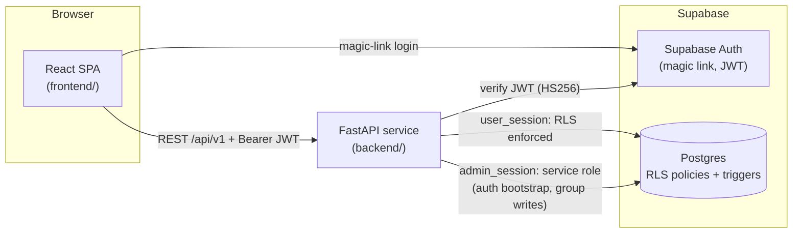

# Unitor

> Teammate matching for university group projects: students join their course with an invite code, build a profile of skills and availability, and find compatible classmates or open groups.

[](https://github.com/eden-chang/unitor/actions/workflows/backend.yml)
[](https://github.com/eden-chang/unitor/actions/workflows/deploy.yml)

Unitor started as a clickable UI prototype for CSC318 (University of Toronto), which lives on in [eden-chang/unitor-demo](https://github.com/eden-chang/unitor-demo). This repository turns it into a full-stack product: a React frontend, a FastAPI service, and a Supabase Postgres database with row-level security. The architecture is documented in ADRs before it was built.

## Features

- **Magic-link sign-in** through Supabase Auth. A roster precheck controls which emails can sign up.
- **Course enrollment by invite code** (`POST /auth/join`). The TA's roster decides the student's section.
- **Profile wizard**: skills with proficiency levels, a weekly availability grid, a preferred communication tool, and a short bio.
- **Discovery board**: lists classmates and forming groups in a course, with section, skill, and text-search filters and cursor pagination.
- **Compatibility scoring**: schedule overlap, skill complementarity, and work-style fit, computed on the server and cached in Postgres. The cache is invalidated by database triggers when a profile changes.
- **Group lifecycle**: create a group, apply with answers to the leader's questions, accept or decline, leave (with leader transfer), and confirm. Accepting an application withdraws the applicant's other pending applications.

Chat, notifications, and the TA dashboard still run on the prototype's mock data. Wiring them to the backend is planned in [`.docs/frontend-stage2-plan.md`](./.docs/frontend-stage2-plan.md).

## Tech stack

| Area | Technology |
|---|---|
| Frontend | React 19, TypeScript, Vite 7, Tailwind CSS 4, shadcn/ui (Radix), TanStack Query, React Router |
| Backend | Python 3.12, FastAPI, Pydantic v2, SQLAlchemy 2 (async) + asyncpg, Alembic |
| Database & auth | Supabase (Postgres with row-level security, Supabase Auth JWTs) |
| Observability | structlog JSON logs, request-ID middleware, Sentry |
| Tooling | uv, ruff, mypy (strict), pytest, ESLint, GitHub Actions |
| Shared types | `openapi-typescript` generates TS types from the backend's OpenAPI schema |

## Architecture



- **Two database session modes.** User-facing endpoints run as the `authenticated` role with the caller's JWT claims set on the connection, so Postgres RLS enforces access. A separate service-role `admin_session` is used only for bootstrap, group writes, and admin or cron code. ([ADR 0002](./.docs/decisions/0002-backend-stack.md), [ADR 0009](./.docs/decisions/0009-audit-corrections.md))
- **Migrations are the schema source of truth.** All tables, RLS policies, and triggers live in `backend/alembic/versions/`. ([ADR 0006](./.docs/decisions/0006-development-toolchain.md))
- **Consistent error format.** Every error response uses one JSON shape with a machine-readable code. ([ADR 0008](./.docs/decisions/0008-conventions.md))
- **Multi-tenancy on one database.** A single Postgres instance holds all universities and courses, and row-level security keeps tenants apart. ([ADR 0001](./.docs/decisions/0001-multi-tenancy.md))

## Getting started

### Prerequisites

- Node.js 20+ and npm
- Python 3.12 and [uv](https://docs.astral.sh/uv/)
- A Supabase project (URL, anon key, service-role key, JWT secret, and database connection strings)

### Backend

```bash
cd backend
uv sync --all-groups
cp .env.example .env               # fill in your Supabase values
uv run alembic upgrade head        # apply the schema
uv run python -m scripts.seed_dev --email you@example.com   # optional demo data
uv run uvicorn app.main:app --reload --port 8000
```

- Health check: `curl http://localhost:8000/api/v1/health`
- Interactive API docs (disabled in prod): http://localhost:8000/api/v1/docs

More detail is in [`backend/README.md`](./backend/README.md).

### Frontend

```bash
cd frontend
npm ci
cp .env.example .env               # Supabase URL + anon key, API base URL
npm run dev                        # http://localhost:5173/unitor-demo/
```

The Supabase client throws on startup if `VITE_SUPABASE_URL` or `VITE_SUPABASE_ANON_KEY` is missing.

A `Makefile` at the repo root wraps the common commands. Run `make help` to list them (for example `make be-test`, `make fe-build`, `make check`).

## Environment variables

Use the `.env.example` files as templates. Never commit real values.

**`backend/.env`**

| Variable | Description |
|---|---|
| `DATABASE_URL` | Supabase pooler connection string (transaction mode, port 6543), used by the API |
| `DATABASE_DIRECT_URL` | Direct connection string (port 5432), used by Alembic and the seed script |
| `SUPABASE_URL` | Supabase project URL |
| `SUPABASE_ANON_KEY` | Supabase anon key |
| `SUPABASE_SERVICE_ROLE_KEY` | Service-role key, used only by `admin_session` |
| `SUPABASE_JWT_SECRET` | Secret for verifying Supabase access tokens |
| `SUPABASE_JWT_SECRET_PREVIOUS` | Optional previous secret, accepted during key rotation |
| `CRON_TOKEN` | Shared secret for scheduled-job endpoints (`X-Cron-Token`) |
| `CORS_ALLOWED_ORIGINS` | Comma-separated allowed origins (default `http://localhost:5173`) |
| `SENTRY_DSN`, `RESEND_API_KEY` | Optional: error reporting and email |

**`frontend/.env`**

| Variable | Description |
|---|---|
| `VITE_SUPABASE_URL` | Supabase project URL |
| `VITE_SUPABASE_ANON_KEY` | Supabase anon key. This key is meant to be public; RLS protects the data |
| `VITE_API_BASE_URL` | Backend base URL (default `http://localhost:8000/api/v1`) |

## API overview

All routes are served under `/api/v1`:

| Area | Endpoints |
|---|---|
| Health | `GET /health`, `GET /health/ready`, `GET /version` |
| Auth | `POST /auth/precheck`, `POST /auth/bootstrap`, `POST /auth/join` |
| Users | `PATCH /users/me` |
| Profiles | `POST /profiles`, `GET /profiles/me/{course_id}`, `GET/PATCH/DELETE /profiles/{id}`, `PUT /profiles/{id}/skills`, `PUT /profiles/{id}/schedule`, `POST /profiles/{id}/complete` |
| Courses | `GET /courses/{id}`, `GET /courses/{id}/sections`, `GET /courses/{id}/skills` |
| Discovery | `GET /courses/{id}/students`, `GET /courses/{id}/groups` |
| Compatibility | `POST /compatibility/batch` |
| Groups | `POST /groups`, `GET/PATCH /groups/{id}`, `POST /groups/{id}/apply`, `GET /groups/{id}/applications`, `POST /groups/{id}/leave`, `POST /groups/{id}/confirm` |
| Applications | `POST /applications/{id}/accept`, `POST /applications/{id}/decline` |

## Testing

```bash
cd backend
uv run pytest tests/unit/ -q      # 90 unit tests, no network or database needed
uv run ruff check . && uv run ruff format --check .
uv run mypy app

cd ../frontend
npm run typecheck
npm run build
```

The **Backend CI** workflow runs ruff, the format check, mypy, the unit tests, and an offline check that the Alembic migrations form a single head, on every push or PR that touches `backend/`. The **Deploy** workflow builds the frontend and publishes it to GitHub Pages.

## Project structure

```
unitor/
├── frontend/                 # React + Vite SPA
│   └── src/
│       ├── api/              # Typed fetch wrappers per backend resource
│       ├── components/       # auth, dashboard, discovery, groups, profile, shared, ui
│       ├── context/          # Auth provider (Supabase session)
│       ├── hooks/            # TanStack Query hooks (useDiscovery, useGroups, ...)
│       └── App.tsx           # Page routing + prototype pages not yet migrated
├── backend/                  # FastAPI service
│   ├── app/
│   │   ├── api/v1/           # Route handlers
│   │   ├── services/         # Business logic (compatibility, groups, discovery, ...)
│   │   ├── db/               # user_session / admin_session + SQLAlchemy models
│   │   ├── schemas/          # Pydantic request/response models
│   │   └── auth/jwt.py       # Supabase JWT verification
│   ├── alembic/versions/     # 11 migrations: tables, enums, RLS policies, triggers
│   ├── scripts/seed_dev.py   # Idempotent demo seed (UofT / CSC318)
│   └── tests/unit/           # pytest suite
├── packages/api-types/       # TS types generated from the backend OpenAPI schema
├── .docs/                    # ADRs, ERD, auth flows, matching spec, API surface
├── .github/workflows/        # backend.yml (CI), deploy.yml (GitHub Pages)
└── Makefile                  # Dev shortcuts for both sides
```

## Design documents

The design was written down before the code. The documents are in [`.docs/`](./.docs/README.md):

- [`decisions/`](./.docs/decisions/README.md): 10 ADRs covering multi-tenancy, backend stack, infrastructure, data strategy, repo layout, toolchain, domain modeling, conventions, and two architecture-audit follow-ups
- [`06-erd.md`](./.docs/06-erd.md): entity-relationship design and RLS policies
- [`07-auth-flows.md`](./.docs/07-auth-flows.md): signup, login, and JWT verification
- [`08-matching-spec.md`](./.docs/08-matching-spec.md): compatibility algorithm and test vectors
- [`10-api-surface.md`](./.docs/10-api-surface.md): endpoint inventory mapped to frontend screens
